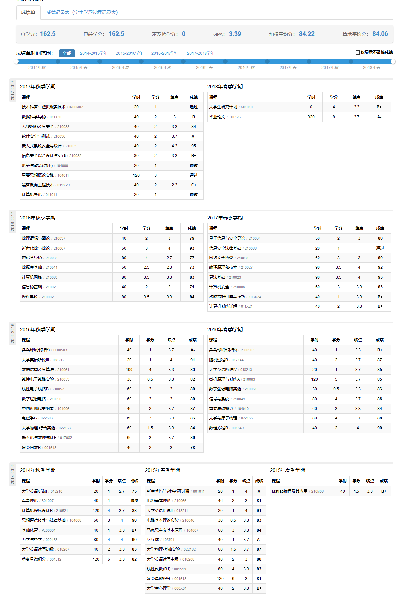
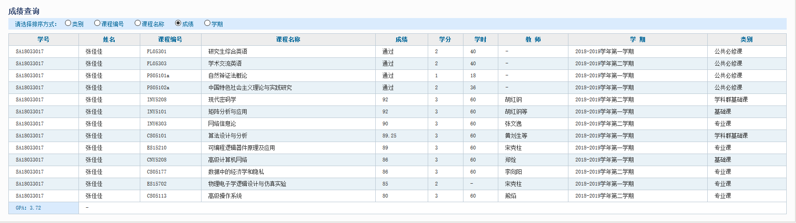

## Welcome to Zhangjiajia's GitHub Pages
This page is used to display some useful information with convenient access!

## 成绩单
### 本科成绩单

### 研究生成绩单


## 论文发表
```
Title:    	A Novel Evaluation Metric for Deep Learning-Based Side Channel Analysis and Its Extended Application to Imbalanced Data
Key words:	Side Channel Analysis, Deep Learning, Evaluation Metric, Imbalanced Data

Abstract:
Since Kocher (CRYPTO'96) proposed timing attack, side channel analysis (SCA)
has shown great potential to break cryptosystem via physical leakage.
Recently, deep learning techniques are widely used in SCA and show equivalent
and even better performance compared to traditional methods. However, it
remains unknown why and when deep learning techniques are effective and
efficient for SCA. Masure et al. (IACR TCHES 2020(1):348--375) illustrated
that deep learning paradigm is suitable for evaluating implementations against
SCA from a worst-case scenario point of view, yet their work is limited to
balanced data and a specific loss function. Besides, deep learning metrics are
not consistent with side channel metrics. In most cases, they are deceptive in
foreseeing the feasibility and complexity of mounting a successful attack,
especially for imbalanced data.
To mitigate the gap between deep learning metrics and side channel metrics, we
propose a novel Cross Entropy Ratio (CER) metric to evaluate the performance
of deep learning models for SCA. CER is closely related to traditional side
channel metrics Guessing Entropy (GE) and Success Rate (SR) and fits to deep
learning scenario. Besides, we show that it works stably while deep learning
metrics such as accuracy becomes rather unreliable when the training data
tends to be imbalanced. However, estimating CER can be done as easy as natural
metrics in deep learning algorithms with low computational complexity.
Furthermore, we adapt CER metric to a new kind of loss function, namely CER
loss function, designed specifically for deep learning in side channel
scenario. In this way, we link directly the SCA objective to deep learning
optimization. Our experiments on several datasets show that, for SCA with
imbalanced data, CER loss function outperforms Cross Entropy loss function in
various conditions.

```

Accepted to IACR Transactions on Cryptographic Hardware and Embedded Systems (TCHES) 2020-Issue 3
